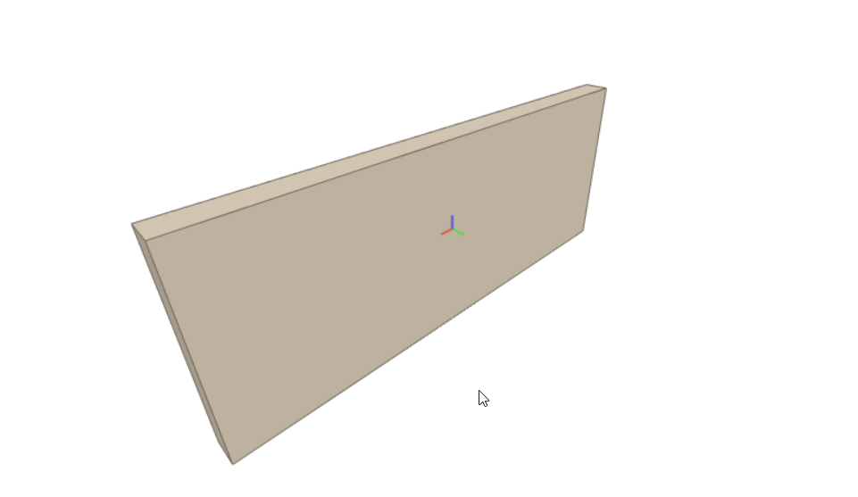
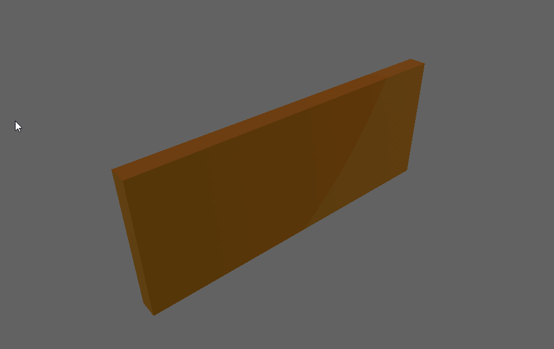

# ifc2gltf

Experimental tool, converts from IFC geometries to glTF 2.0

## Parameters

-i : input file

-o : output file

Sample:

```
$ ifc2gltf -i wall.ifc -o wall.glb

tool ifc2gltf
Input file: wall.ifc
Output file: wall.glb
Start converting to glTF...
Number of geometries: 2507
Converting to glTF finished.
Elapsed: 00:00:07.5423802
```

## Results

First case: wall.ifc:



Converted to glb:



## Dependencies

- SharpGLTF

- XBim.Essentials

- XBim.Geometry (only works on Windows)

- CommandLineParser

